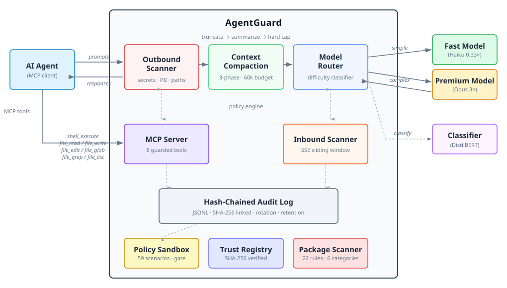

# AgentGuard

**Safety guardrails for autonomous AI agents. Policy enforcement, tamper-evident
audit logging, and LLM API filtering — the agent never even knows it's being
guarded.**

[](https://github.com/Roboter-Schlafen-Nicht/agentguard/actions/workflows/ci.yml)
[](https://www.gnu.org/licenses/agpl-3.0)
[](https://www.python.org/downloads/)

---

## The Problem

AI coding agents run shell commands, read your secrets, and write to
production files. Today there is **nothing between the LLM and your
system** except trust.

That trust is misplaced:

- Prompt injections can make an agent `rm -rf /` or `git push --force`
- A hallucinating model can overwrite `.env` with garbage
- Secrets and PII leak into LLM prompts — sent to third-party APIs
- LLM responses can contain injected instructions or exfiltration attempts
- There is no audit trail of what the agent actually did
- Compliance teams have no evidence that AI actions were supervised

## The Solution

AgentGuard guards AI agents at **two layers**:

1. **MCP Server** — sits between the agent and your OS. Intercepts
   `shell_execute`, `file_read`, `file_write`, `file_edit`, `file_glob`,
   `file_grep`, and `file_list` calls. Enforces policies before
   execution. Works with any MCP client (see
   [enforcement levels](#mcp-client-enforcement) below).

2. **LLM API Proxy** — sits between the agent and the LLM API. Scans
   outbound prompts for secrets/PII before they reach the LLM. Scans
   inbound responses for prompt injection and exfiltration patterns in
   real time, including streaming (SSE). Terminates dangerous streams
   mid-flight.

<p align="center">
  
</p>

**The agent doesn't know it's being guarded.** Zero prompt engineering.
Zero cooperation required from the LLM.

## Quick Start

### MCP Server — guard tool calls

Install and point your MCP client at AgentGuard:

```bash
pip install agentguard[mcp]
```

```json
{
  "mcpServers": {
    "agentguard": {
      "command": "python",
      "args": ["-m", "agentguard", "serve", "--preset", "balanced", "--audit-dir", "audit/"]
    }
  }
}
```

Every `shell_execute`, `file_read`, `file_write`, `file_edit`,
`file_glob`, `file_grep`, and `file_list` call now passes through
AgentGuard. Denied actions never execute. Everything is logged.

### MCP Client Enforcement

AgentGuard's MCP server provides 7 action tools and 2 sidecar tools.
Enforcement coverage depends on whether the MCP client has its own
native tools that bypass the MCP server:

| Client | Native Tools? | Full Enforcement? | Notes |
|--------|:---:|:---:|---|
| **Claude Desktop** | No | ✅ Yes | All tools come from MCP — full coverage |
| **OpenCode** | Yes | ✅ Yes | Deny native tools via config (see below) |
| **Cursor** | Yes | ⚠️ Partial | Native tools bypass AgentGuard |
| **Windsurf** | Yes | ⚠️ Partial | Native tools bypass AgentGuard |
| **VS Code Copilot** | Yes | ⚠️ Partial | Native tools bypass AgentGuard |
| **Cline** | Yes | ⚠️ Partial | Native tools bypass AgentGuard |
| **Zed** | Yes | ⚠️ Partial | Native tools bypass AgentGuard |

For clients with native tools that cannot be disabled, AgentGuard still
enforces policies on all calls that go through the MCP server — but the
agent may also use native tools that bypass enforcement entirely.

**OpenCode full enforcement:** Add permission denials to your
`opencode.json` to route all operations through AgentGuard:

```json
{
  "permission": {
    "bash": "deny",
    "read": "deny",
    "edit": "deny",
    "write": "deny",
    "glob": "deny",
    "grep": "deny"
  }
}
```

### LLM API Proxy — guard prompts and responses

```bash
pip install agentguard[proxy]
```

```bash
agentguard proxy https://api.openai.com \
  --builtins \
  --scan-responses \
  --audit-dir audit/ \
  --port 8080
```

Point your agent's API base URL at `http://localhost:8080` instead of
`https://api.openai.com`. AgentGuard forwards requests transparently,
scanning for policy violations in both directions:

- **Outbound** — blocks secrets, API keys, PII, and internal paths
  from leaking into prompts
- **Inbound** — scans streaming responses for prompt injection,
  persona hijacking, and data exfiltration patterns. Terminates the
  SSE stream and injects a warning when a violation is detected

Compatible with OpenAI, Azure OpenAI, GitHub Copilot, and any
OpenAI-compatible API (LiteLLM, vLLM, Ollama, etc.) via the built-in
provider adapter.

## Features

### Policy Engine

YAML policies with regex-based deny patterns. Separate action kinds
for tool calls (`shell_execute`, `file_read`, `file_write`, `file_edit`,
`file_glob`, `file_grep`, `file_list`) and LLM traffic (`llm_request`,
`llm_response`). Optional `scan` field targets specific parts of LLM
messages (`messages`, `system`, `content`, `all`).

```yaml
# policies/safety.yaml
name: prevent-disasters
description: Block destructive operations
rules:
  - action: shell_execute
    deny:
      - pattern: "git push.*--force"
      - pattern: "git reset --hard"
      - pattern: "rm -rf /"
    severity: critical

  - action: file_write
    deny:
      - pattern: '\.env$'
      - pattern: 'credentials'
    severity: critical
```

```python
from agentguard import Guard

guard = Guard()
guard.load_policy_file("policies/safety.yaml")

result = guard.check("shell_execute", command="git push --force origin main")
assert result.denied
# "Blocked by policy: prevent-disasters"
```

### 11 Built-in Policies

Ship with sensible defaults — load with `--builtins`:

| Policy | Layer | What it blocks |
|--------|-------|----------------|
| `no-force-push` | Tool | `git push --force`, `git reset --hard` |
| `no-data-deletion` | Tool | `rm -rf /`, `DROP TABLE`, `DELETE FROM` |
| `no-secret-exposure` | Tool | Reading `.env`, credentials, key files |
| `no-env-commit` | Tool | Committing `.env` or credential files |
| `no-hook-bypass` | Tool | `--no-verify`, `--no-gpg-sign` |
| `no-secret-in-prompt` | Proxy | API keys, tokens, passwords in prompts |
| `no-pii-leak` | Proxy | Email addresses, SSNs, phone numbers in prompts |
| `no-internal-paths` | Proxy | Internal hostnames, IPs, infrastructure paths |
| `no-prompt-injection` | Proxy | "Ignore previous instructions" and variants |
| `no-persona-jailbreak` | Proxy | DAN, persona override, system prompt injection |
| `detect-drift-triggers` | Proxy | Meta-reflective prompts, emotional manipulation, grandiose responses |

### Tamper-Evident Audit Log

Every action is recorded in a hash-chained JSONL log. Each entry links
to the previous via SHA-256 — if anyone tampers with a single entry,
the chain breaks:

```python
from agentguard.audit import AuditLog

log = AuditLog("session-001")
log.record(action="shell_execute", actor="agent-001", target="ls -la", result="allowed")
log.save("audit/session-001.jsonl")

assert log.verify()  # True — chain is intact
```

### Runtime Guardrails

The `Guardrail` class composes policy checking, execution, and audit
logging into a single call:

```python
from agentguard import Guardrail, Guard
from agentguard.audit import AuditLog
from agentguard.guardrails import ActionResult

guard = Guard()
audit = AuditLog("session")

def my_interceptor(action_kind: str, **params: str) -> ActionResult:
    return ActionResult(action_kind=action_kind, params=params, executed=True, output="ok")

guardrail = Guardrail(guard=guard, interceptor=my_interceptor, audit_log=audit)
result = guardrail.execute("shell_execute", command="echo hello")
```

### EU AI Act Compliance Reports

Generate structured compliance reports from audit data, mapping to
Art. 9 (Risk Management), Art. 12 (Record-keeping), Art. 13
(Transparency), and Art. 14 (Human Oversight):

```python
from agentguard.compliance import EUAIActReportGenerator, render_json

generator = EUAIActReportGenerator()
report = generator.generate(audit)
render_json(report, output="compliance-report.json")
```

```bash
agentguard report eu-ai-act audit/session.jsonl --format json --output report.json
```

### Outbound Scanner

Programmatic detection of sensitive content in text, independent of
the policy engine. 18 regex patterns across 3 categories:

```python
from agentguard.proxy.outbound import scan_text, FindingCategory

findings = scan_text("My API key is sk-abc123xyz")
# [Finding(category=SECRET, name="openai_api_key", ...)]
```

### Inbound Scanner (Streaming)

Streaming-aware response scanner with a sliding window. Feeds SSE
chunks incrementally, runs policy checks against the accumulated
content, and signals denial mid-stream:

```python
from agentguard.proxy.inbound import InboundScanner

scanner = InboundScanner(guard)
for chunk in sse_stream:
    result = scanner.feed(chunk)
    if result is not None:
        # Policy violation detected — terminate stream
        break
summary = scanner.finalize()
```

### Provider Adapters

Pluggable format adapters for different LLM APIs. The `Provider`
protocol defines request/response parsing and streaming content
extraction. Ships with an OpenAI adapter; auto-detected or set
explicitly:

```python
from agentguard.proxy.providers import get_provider, list_providers

provider = get_provider("openai")
params = provider.extract_request_params(body)
content = provider.extract_stream_content(sse_data)
```

### MCP Sidecar Tools

The MCP server exposes `agentguard_status` (loaded policies and
session info), `agentguard_audit_query` (search audit by action,
result, or actor), `agentguard_trust_query` (look up server trust
levels), and `agentguard_scan_package` (scan a package for security
risks) — so you can ask the agent "what policies are active?", "show
me all denied actions", or "scan this MCP server before I install it."

### MCP Action Tools

In addition to `shell_execute`, `file_read`, and `file_write`, the
MCP server provides:

| Tool | Description |
|------|-------------|
| `file_edit` | Exact string replacement in files |
| `file_glob` | Pattern-based file search (mtime-sorted) |
| `file_grep` | Regex content search with file filter |
| `file_list` | Directory listing with ignore patterns |

All 7 action tools enforce policies and log to the audit trail.

### Protection Level Presets

Named policy bundles for quick setup. Three levels trade security for
agent flexibility:

| Preset | Policies | Use case |
|--------|:---:|---|
| `permissive` | 3 | Development — blocks only catastrophic actions |
| `balanced` | 8 | Default — covers tools and basic LLM filtering |
| `strict` | 11 | Production — all policies including drift detection |

```bash
# CLI — mutually exclusive with --builtins
agentguard serve --preset balanced --audit-dir audit/

# MCP config
{
  "args": ["-m", "agentguard", "serve", "--preset", "strict", "--audit-dir", "audit/"]
}
```

```python
from agentguard import Preset, load_preset

policies = load_preset(Preset.BALANCED)
# Returns 8 Policy objects ready to load into a Guard
```

### Trust Registry

Persistent trust levels for MCP servers with hash-based integrity
verification. Track which servers are trusted, restricted, or
untrusted, and verify package integrity before execution.

```bash
# Register a server with a trust level
agentguard trust add my-server --level trusted \
  --package-path /path/to/server --command "python -m my_server"

# Verify package integrity
agentguard trust verify my-server --package-path /path/to/server

# List all registered servers
agentguard trust list --format json
```

```python
from agentguard import TrustRegistry, TrustLevel

registry = TrustRegistry()
registry.add("my-server", TrustLevel.TRUSTED,
             package_path="/path/to/server",
             command="python -m my_server")

entry = registry.get("my-server")
assert entry.verify_hash("/path/to/server")  # True — package unchanged
```

Trust data persists in `~/.agentguard/trust-registry.yaml`. The MCP
server exposes `agentguard_trust_query` for agent-accessible lookups.

### Package Scanner

On-demand static analysis of MCP server source code. Regex-based
line-by-line detection across 6 risk categories with 22+ built-in
rules:

| Category | Examples |
|----------|---------|
| Data exfiltration | HTTP requests, WebSockets, DNS, SMTP, base64 encoding |
| File system access | Sensitive paths (`/etc/passwd`, `.ssh/`), recursive walks, `.env` |
| Code execution | `eval`/`exec`, subprocess, ctypes, dynamic imports |
| Credential access | Hardcoded keys, environment variable lookups, keyring access |
| Persistence | Cron jobs, startup files, systemd, runtime pip install |
| Obfuscation | Hex decoding, character-by-character construction, marshal |

```bash
agentguard scan /path/to/mcp-server-package
agentguard scan /path/to/package --format json --min-severity high
```

```python
from agentguard import Scanner

scanner = Scanner()
result = scanner.scan("/path/to/mcp-server-package")
print(result.finding_count, result.max_severity)

for finding in result.findings:
    print(f"[{finding.severity.value}] {finding.rule_id}: {finding.message}")
    print(f"  at {finding.file_path}:{finding.line_number}")
```

> **Caveat:** The scanner is a **safety net for first-pass triage**, not
> a security boundary. Regex-based detection is bypassable by
> adversarial code via string concatenation, encoding, or indirection.
> It catches accidental risks and low-sophistication threats, but should
> not be relied on as a sole defence against malicious packages.

## CLI

```
agentguard version                          Print version
agentguard policies [--dir DIR] [--builtins] List loaded policies
agentguard check ACTION [--params K=V ...]  Test an action against policies
agentguard audit verify FILE                Verify audit log integrity
agentguard audit query FILE [--action ...]  Query audit entries
agentguard report FRAMEWORK FILE            Generate compliance report
agentguard serve [--builtins|--preset LEVEL] Start MCP server
agentguard proxy URL [--scan-responses]     Start LLM API proxy
agentguard scan PATH [--format FMT]         Scan a package for security risks
agentguard trust add NAME [--level LEVEL]   Register a server in trust registry
agentguard trust remove NAME                Remove a server
agentguard trust list [--level LEVEL]        List registered servers
agentguard trust show NAME                  Show server details
agentguard trust verify NAME --package-path  Verify package integrity
agentguard trust update-hash NAME           Recompute stored hash
```

## Installation

```bash
# Core policy engine + audit (no network dependencies)
pip install agentguard

# With MCP server
pip install agentguard[mcp]

# With LLM API proxy
pip install agentguard[proxy]

# Everything
pip install agentguard[mcp,proxy]
```

Requires Python 3.10+. Tested on 3.10, 3.11, 3.12, and 3.13.

## Architecture

```
src/agentguard/
  policies/         Policy engine: Rule, Guard, YAML loader, 11 built-in policies, presets
  audit/            Audit logging: hash-chained JSONL, integrity verification
  guardrails/       Runtime interceptor: Guardrail, hooks, ActionResult
  compliance/       Report generators: EU AI Act, JSON/text renderers
  mcp/              MCP server: transparent tool proxy with policy enforcement
  proxy/            LLM API proxy: middleware, outbound/inbound scanners
    providers/      Format adapters: Provider protocol, OpenAI adapter
  scanner/          Package scanner: regex-based source code analysis, 6 risk categories
  trust/            Trust registry: trust levels, hash verification, YAML persistence
  cli.py            Command-line interface
```

### Design Principles

1. **Transparent** — agents don't know they're guarded
2. **Zero-trust** — no reliance on LLM cooperation or prompt adherence
3. **Auditable** — every action is hash-chained and verifiable
4. **Two-layer** — guards both tool calls (MCP) and LLM traffic (proxy)
5. **Streaming-aware** — scans SSE responses in real time, terminates on violation
6. **Extensible** — YAML policies, pluggable providers, pluggable interceptors
7. **Type-safe** — full mypy strict compliance, py.typed marker
8. **Tested** — 1182 tests, TDD, CI on Python 3.10–3.13

## Roadmap

- [x] Core policy engine (YAML + Python policies, 11 built-in policies)
- [x] Audit log with SHA-256 hash-chaining and integrity verification
- [x] Runtime guardrail interceptor with pre/post hooks
- [x] EU AI Act compliance report generator (JSON + text)
- [x] MCP server with transparent policy enforcement and sidecar tools
- [x] Extended MCP tools (file_edit, file_glob, file_grep, file_list)
- [x] CLI tool (`check`, `audit`, `policies`, `report`, `serve`, `proxy`)
- [x] LLM API proxy with outbound scanner (secrets, PII, internal paths)
- [x] Streaming inbound scanner (SSE sliding window, mid-stream termination)
- [x] Built-in prompt/response policies (4 proxy policies)
- [x] OpenAI-compatible provider adapter with auto-detection
- [x] Protection level presets (`strict` / `balanced` / `permissive`)
- [x] Trust registry for MCP servers (trust levels, hash verification)
- [x] MCP server package scanner (on-demand source code audit)
- [ ] Anthropic provider adapter
- [ ] Audit log rotation, retention, and cross-session aggregation
- [ ] ISO 42001 and NIST AI RMF compliance reports
- [ ] SOC 2 audit evidence mapping
- [ ] Real-time denial notifications and dashboard integration
- [ ] Conditional policies (time-of-day, branch, environment rules)
- [x] Persona safety policies (jailbreak detection, drift monitoring)

## Who This Is For

- **Engineering teams** deploying AI coding agents (Copilot, Cursor,
  Claude) who need guardrails before the agent touches production
- **Security teams** who need audit trails and policy enforcement for
  AI-assisted workflows, including LLM API traffic filtering
- **Compliance teams** who need evidence that AI actions are supervised
  and logged per EU AI Act requirements
- **Anyone** running autonomous agents who wants to sleep at night

## Contributing

See [CONTRIBUTING.md](CONTRIBUTING.md) for guidelines.

## License

AGPL-3.0-or-later. See [LICENSE](LICENSE) for details.

---

Built by [Roboter Schlafen Nicht](https://github.com/Roboter-Schlafen-Nicht) —
autonomous engineering consultancy. We build AI agents for production
and needed this tool ourselves.
